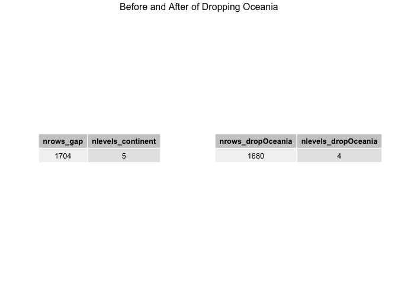

Factor and figure management
================
Irissq28
11th October, 2018

-   [Overview](#overview)
-   [The Assignment](#the-assignment)
    -   [Part 1: Factor management: Elaboration for the gapminder data set](#part-1-factor-management-elaboration-for-the-gapminder-data-set)
        -   [Drop Oceania](#drop-oceania)
        -   [Reorder the levels of `country` or `continent`](#reorder-the-levels-of-country-or-continent)
    -   [Part 2: File I/O](#part-2-file-io)
        -   [Experiment with write\_csv()/read\_csv()](#experiment-with-write_csvread_csv)
        -   [Experiment with saveRDS()/readRDS()](#experiment-with-saverdsreadrds)
        -   [Experiment with dput()/dget()](#experiment-with-dputdget)
    -   [Part 3: Visualization design](#part-3-visualization-design)
        -   [Original and new figure1](#original-and-new-figure1)
        -   [Original and new figure2](#original-and-new-figure2)
    -   [Part 4: Writing figures to file](#part-4-writing-figures-to-file)
        -   [Write the frigure](#write-the-frigure)
        -   [Reload the frigure](#reload-the-frigure)
    -   [But I want to do more](#but-i-want-to-do-more)
        -   [Create a data frame](#create-a-data-frame)
        -   [Change the name of levels](#change-the-name-of-levels)
        -   [Combine the levels into groups](#combine-the-levels-into-groups)

Overview
========

Goals:

-   Reorder a factor in a principled way based on the data and demonstrate the effect in arranged data and in figures.
-   Write some data to file and load it back into R.
-   Improve a figure (or make one from scratch), using new knowledge, e.g., control the color scheme, use factor levels, smoother mechanics.
-   Make a plotly visual.
-   Implement visualization design principles.

The Assignment
==============

Part 1: Factor management: Elaboration for the gapminder data set
-----------------------------------------------------------------

Here are the to-do lists of this part:

1.  Drop factor/levels;
2.  Reorder levels based on knowledge from data.

I'm going to elaborate on these steps for gaominder data sets below.

Also characterize the (derived) data before and after factor re-leveling.

-   Explore the effects of `arrange()`. Does merely arranging the data have any effect on, say, a figure?

-   Explore the effects of reordering a factor and factor reordering coupled with `arrange()`. Especially, what effect does this have on a figure?

These explorations will involve the data, the factor levels, and some figures.

**Elaboration for the gapminder data set**

``` r
# setting up
suppressPackageStartupMessages(library(gapminder))
suppressPackageStartupMessages(library(dplyr))
suppressPackageStartupMessages(library(tidyverse))
suppressPackageStartupMessages(library(ggplot2))
suppressPackageStartupMessages(library(tidyr))
suppressPackageStartupMessages(library(gridBase))
suppressPackageStartupMessages(library(grid))
suppressPackageStartupMessages(library(gridExtra))
suppressPackageStartupMessages(library(forcats))
suppressPackageStartupMessages(library(plotly))
suppressPackageStartupMessages(library(scales))
```

### Drop Oceania

*Drop Oceania.* Filter the Gapminder data to remove observations associated with the continent of Oceania. Additionally, remove unused factor levels. Provide concrete information on the data before and after removing these rows and Oceania; address the number of rows and the levels of the affected factors.

Let's check the dimension of the gapminder data set before we drop the Oceania.

``` r
gap <- gapminder %>%
  summarize(nrows_gap = nrow(gapminder),
            nlevels_continent = nlevels(gapminder$continent))
# show the table
knitr::kable(gap)
```

|  nrows\_gap|  nlevels\_continent|
|-----------:|-------------------:|
|        1704|                   5|

After I dropped the Oceania level,this level doesn't always have to be present ("observed") in the factor. Here are 2 ways we can drop it. Let's do it in both methods.

-   `droplevels()` operates on either an entire data frame or a factor.

``` r
# data set after drop Oceania
dropOceania <- gapminder %>%
  filter(continent != "Oceania") %>%
  # remove unused factor levels
  droplevels() 
# summarize dropOceania
dropOceania_s<-dropOceania %>%
  summarize(nrows_dropOceania = nrow(dropOceania),
            nlevels_dropOceania = nlevels(dropOceania$continent))
knitr::kable(dropOceania_s)
```

|  nrows\_dropOceania|  nlevels\_dropOceania|
|-------------------:|---------------------:|
|                1680|                     4|

-   `forcats::fct_drop()` only operates on a factor.

``` r
# data set after drop Oceania
dropOceania1 <- gapminder %>%
  filter(continent != "Oceania") %>%
  # fct_drop() operates on a factor
  mutate(continent = fct_drop(continent)) 
# summarize dropOceania1
dropOceania1_s <- dropOceania1 %>%
  summarize(nrows_dropOceania1 = nrow(dropOceania1),
            nlevels_dropOceania1 = nlevels(dropOceania1$continent))
knitr::kable(dropOceania1_s)
```

|  nrows\_dropOceania1|  nlevels\_dropOceania1|
|--------------------:|----------------------:|
|                 1680|                      4|

As we can see the results are the same. To summarize, let's provide concrete information on the data before and after removing these rows and address the number of rows and the levels of the affected factors.

``` r
tt <- ttheme_default(
  # Use the smaller text size
  core = list(fg_params=list(cex = 0.8)),
  colhead = list(fg_params=list(cex = 0.8)), 
  rowhead = list(fg_params=list(cex = 0.8)), rows=NULL)

gap_table <- tableGrob(gap,rows = NULL,theme = tt)
dropOceania_table <- tableGrob(dropOceania_s,rows = NULL,theme = tt)

grid.arrange(gap_table, dropOceania_table,
             nrow = 1, top = "Before and After of Dropping Oceania")
```



### Reorder the levels of `country` or `continent`

Use the `forcats` package to change the order of the factor levels, based on a principled summary of one of the quantitative variables. Consider experimenting with a summary statistic beyond the most basic choice of the median.

#### Effects of `arrange()` on numeric variable

To explore the effects of `arrange()` on data, let's summarize the mean value of lifeExp in each continent in year 2007.

``` r
#before arrange
lifeExp_mean_un <- gapminder %>%
  group_by(continent) %>%
  filter(year == 2007) %>%
  summarize(lifeExp_mean_un = mean(lifeExp))
knitr::kable(lifeExp_mean_un)
```

| continent |  lifeExp\_mean\_un|
|:----------|------------------:|
| Africa    |           54.80604|
| Americas  |           73.60812|
| Asia      |           70.72848|
| Europe    |           77.64860|
| Oceania   |           80.71950|

``` r
#after arrange
lifeExp_mean <- gapminder %>%
  group_by(continent) %>%
  filter(year == 2007) %>%
  summarize(lifeExp_mean = mean(lifeExp)) %>%
  arrange(lifeExp_mean)
knitr::kable(lifeExp_mean)
```

| continent |  lifeExp\_mean|
|:----------|--------------:|
| Africa    |       54.80604|
| Asia      |       70.72848|
| Americas  |       73.60812|
| Europe    |       77.64860|
| Oceania   |       80.71950|

From the table above, the order of America and Asia changed, it seems like the `arrange()` has effect on data.

#### Effects of `arrange()` on figure

But what about the effect on figure? Let's apply the arranged `lifeExp_mean` data set.

``` r
lifeExp_mean %>%
  ggplot(aes(continent,lifeExp_mean, fill =  continent)) +
  geom_bar(stat = "identity", position = position_dodge(),
           alpha=0.8, show.legend = FALSE) +
  labs(x = "Continent", y = "Mean value of lifeExp", title = "Mean value of lifeExp in each continent in 2007") +
  scale_fill_brewer(palette = "Set3") +
  theme_bw() +
  theme(plot.title = element_text(size = 13, hjust = 0.5))
```


It can be easily noticed that `arrange()` doesn't have any effects on figures, because each continent isn't sorted by the mean value of lifeExp in decresing order.

#### Reordering a factor

Before the exploration, let's summarize the description of Reorder factor levels by sorting along another variable by using `fct_reorder()` or `fct_reorder2()`, which is from [R Documentation](https://www.rdocumentation.org/packages/forcats/versions/0.3.0/topics/fct_reorder)

*fct\_reorder() is useful for 1d displays where the factor is mapped to position; fct\_reorder2() for 2d displays where the factor is mapped to a non-position aesthetic. last2() is a helper for fct\_reorder2(); it finds the last value of y when sorted by x*

To explore further, what if reorder a factor is needed, since `fct_reorder()` is useful for 1d displays where the factor is mapped to position, which is suitable for our lifeExp\_mean data set. Let's try to use `fct_reorder()` only and `fct_reorder()` and `arrange()` together. we reordered the bar plot above.

**`fct_reorder()` only**

By default, `fct_reorder()` and `fct_reorder2()` are in ascending order, if you want to display figure in descending order, using `.desc = TRUE`.

``` r
lifeExp_mean %>%
  # reorder the contiennt factor in ascending order
  mutate(continent = fct_reorder(continent,lifeExp_mean)) %>%
  ggplot(aes(continent,lifeExp_mean, fill =  continent)) +
  # remove the legend
  geom_bar(stat = "identity", position = position_dodge(),
           alpha=0.8,show.legend = FALSE) +
  labs(x = "Continent", y = "Mean value of lifeExp", title = "Mean value of lifeExp in each continent in 2007") +
  scale_fill_brewer(palette = "Set3") +
  # theme in black and white
  theme_bw() +
  # title is centerd, title size is adjusted
  theme(plot.title = element_text(size = 12,hjust = 0.5))
```


**`fct_reorder()` and `arrange()` together**

``` r
lifeExp_mean %>%
  # see the effects of `fct_reorder()` and `arrange()`combination
  arrange(lifeExp_mean) %>%
  # reorder the contiennt factor in ascending order
  mutate(continent = fct_reorder(continent,lifeExp_mean)) %>%
  ggplot(aes(continent,lifeExp_mean, fill =  continent)) +
  # remove the legend
  geom_bar(stat = "identity", position = position_dodge(),
           alpha=0.8, show.legend = FALSE) +
  labs(x = "Continent", y = "Mean value of lifeExp", title = "Mean value of lifeExp in each continent in 2007") +
  scale_fill_brewer(palette = "Set3") +
  # theme in black and white
  theme_bw() +
  # title is centerd, title size is adjusted
  theme(plot.title = element_text(size = 12,hjust = 0.5)) 
```


As we can see, all continents are sorted by the decreasing mean value of lifeExp, which means no matter with `arrange()` or not, `fct_reorder()` can reorder a factor.

Still wondering does `fct_reorder2()` has the same effects on reordering a factor?

Now let's find the effects of `fct_reorder2()` for 2d displays where the factor is mapped to a non-position, using the data frome of the trend of population in selected countries.

``` r
select_countries <- c("Canada", "America", "Norway", 
                      "Germany", "Australia","Greece")
pop_select <- gapminder %>% 
  filter(country %in% select_countries) %>% 
  #remove unused factor levels
  droplevels()
ggplot(pop_select, aes(year, pop)) +
  geom_line(aes(colour=country)) +
  labs(x = "year", y = "population", title = "The trend of population in selected countries") +
  scale_color_brewer(palette = "Dark2") +
  # theme in black and white
  theme_bw() +
  # title is centerd, title size is adjusted
  theme(plot.title = element_text(size = 12,hjust = 0.5)) 
```


Using `arrange()` only

``` r
pop_select %>%
  arrange(pop) %>%
  ggplot(aes(year, pop)) +
  geom_line(aes(group=country, colour=country)) +
  labs(x = "year", y = "population", title = "The trend of population in selected countries") +
  scale_color_brewer(palette = "Dark2") +
  # theme in black and white
  theme_bw() +
  # title is centerd, title size is adjusted
  theme(plot.title = element_text(size = 12,hjust = 0.5)) 
```


After the application of `fct_reorder2()`.

``` r
pop_select %>%
  mutate(country = fct_reorder2(country,year,pop)) %>%
  ggplot(aes(year, pop)) +
  geom_line(aes(group=country, colour=country)) +
  labs(x = "year", y = "population", title = "The trend of population in selected countries") +
  scale_color_brewer(palette = "Dark2") +
  # theme in black and white
  theme_bw() +
  # title is centerd, title size is adjusted
  theme(plot.title = element_text(size = 12,hjust = 0.5)) 
```


Using `fct_reorder2()` and `arrange()` together.

``` r
pop_select %>%
  mutate(country = fct_reorder2(country,year,pop)) %>%
  arrange(pop) %>%
  ggplot(aes(year, pop)) +
  geom_line(aes(group=country, colour=country)) +
  labs(x = "year", y = "population", title = "The trend of population in selected countries") +
  scale_color_brewer(palette = "Dark2") +
  # theme in black and white
  theme_bw() +
  # title is centerd, title size is adjusted
  theme(plot.title = element_text(size = 12,hjust = 0.5)) 
```


**Conclusion(s):** Based on what we discussed above, no matter with `arrange()` or not, `fct_reorder()`(`fct_reorder2()`) can reorder a factor.

Part 2: File I/O
----------------

*Experiment with one or more of write\_csv()/read\_csv() (and/or TSV friends), saveRDS()/readRDS(), dput()/dget(). Create something new, probably by filtering or grouped-summarization of Gapminder. I fiddle with the factor levels, i.e. make them non-alphabetical. Explore whether this survives the round trip of writing to file then reading back in.*

#### Experiment with write\_csv()/read\_csv()

To verify whether the data is still survives the round trip of writing to file then reading back in, I choose the `pop_select` data frame, which describes the lifeExp,pop and gdpPercap in those countries in each year.

``` r
pop_select_countries <- pop_select %>%
  arrange(pop) %>%
  group_by(country) %>%
  summarise(max_pop = max(pop))
grid.arrange(tableGrob(pop_select_countries, theme = tt, rows = NULL),
             top = "Maximum population in selected countries")
```


I'm going to use `arrange` to reshape the data frame, make them non-alphabetical.

``` r
reshaped_pop_select <- pop_select %>%
  mutate(country = fct_reorder(country,pop,max)) %>%
  group_by(country) %>%
  summarise(max_pop = max(pop))

# show the internal structure of reshaped_pop_select
str(reshaped_pop_select)
```

    ## Classes 'tbl_df', 'tbl' and 'data.frame':    5 obs. of  2 variables:
    ##  $ country: Factor w/ 5 levels "Norway","Greece",..: 1 2 3 4 5
    ##  $ max_pop: num  4627926 10706290 20434176 33390141 82400996

``` r
grid.arrange(tableGrob(reshaped_pop_select, theme = tt, rows = NULL),
             top = "Maximum population in selected countries")
```


From the above data, it can be noticed that the alphabetical order is completely disrupted. Let's save it in `csv` file.

``` r
# wirte to .csv
write_csv(reshaped_pop_select,"reshaped_pop_select.csv")
# read .csv
reshaped_csv <- read_csv("reshaped_pop_select.csv")
```

    ## Parsed with column specification:
    ## cols(
    ##   country = col_character(),
    ##   max_pop = col_integer()
    ## )

``` r
# show  the internal structure of reshaped_csv
reshaped_csv %>%
  str()
```

    ## Classes 'tbl_df', 'tbl' and 'data.frame':    5 obs. of  2 variables:
    ##  $ country: chr  "Norway" "Greece" "Australia" "Canada" ...
    ##  $ max_pop: int  4627926 10706290 20434176 33390141 82400996
    ##  - attr(*, "spec")=List of 2
    ##   ..$ cols   :List of 2
    ##   .. ..$ country: list()
    ##   .. .. ..- attr(*, "class")= chr  "collector_character" "collector"
    ##   .. ..$ max_pop: list()
    ##   .. .. ..- attr(*, "class")= chr  "collector_integer" "collector"
    ##   ..$ default: list()
    ##   .. ..- attr(*, "class")= chr  "collector_guess" "collector"
    ##   ..- attr(*, "class")= chr "col_spec"

``` r
grid.arrange(tableGrob(reshaped_csv, theme = tt, rows = NULL),
             top = "Maximum population in selected countries")
```


From the table above, it can be noticed that we can make new data frame non-alphabetical by writing the data frame into `.csv` file, but the class of country changed from <fct> to <chr>.

#### Experiment with saveRDS()/readRDS()

`saveRDS()/readRDS()` *Description: Functions to write a single R object to a file, and to restore it.*

``` r
# save to .rds
saveRDS(reshaped_pop_select,"reshaped_pop_select.rds")
# read .rds
reshaped_rds <- readRDS("reshaped_pop_select.rds")

# show  the internal structure of reshaped_csv
reshaped_rds %>%
  str()
```

    ## Classes 'tbl_df', 'tbl' and 'data.frame':    5 obs. of  2 variables:
    ##  $ country: Factor w/ 5 levels "Norway","Greece",..: 1 2 3 4 5
    ##  $ max_pop: num  4627926 10706290 20434176 33390141 82400996

``` r
grid.arrange(tableGrob(reshaped_rds, theme = tt, rows = NULL),
             top = "Maximum population in selected countries")
```


From the table and structure mentioned above, we can see that saveRDS()/readRDS() can keep both data and classes of a data frame.

#### Experiment with dput()/dget()

`dput()/dget()` *Description: Writes an ASCII text representation of an R object to a file or connection, or uses one to recreate the object.*

``` r
#put to .txt
dput(reshaped_pop_select,"reshaped_pop_select.txt")
#get .txt
reshaped_txt <- dget("reshaped_pop_select.txt")

# show  the internal structure of reshaped_csv
reshaped_txt %>%
  str()
```

    ## Classes 'tbl_df', 'tbl' and 'data.frame':    5 obs. of  2 variables:
    ##  $ country: Factor w/ 5 levels "Norway","Greece",..: 1 2 3 4 5
    ##  $ max_pop: num  4627926 10706290 20434176 33390141 82400996

``` r
grid.arrange(tableGrob(reshaped_txt, theme = tt, rows = NULL),
             top = "Maximum population in selected countries")
```

/dget()-1.png)

From the table and structure mentioned above, we can see that dput()/dget() can also keep both data and classes of a data frame.

Part 3: Visualization design
----------------------------

### Original and new figure1

Remake the figure I used in [assignment 3](https://github.com/STAT545-UBC-students/hw03-Irissq28/blob/master/hw03.md)

Here is the original figure, which describes the changing of life expectancy over time in each continent.

``` r
lifeExp_change<-gapminder %>%
  group_by(continent,year) %>%
  summarize(meanlifeExp=mean(lifeExp))
lifeExp_change %>%
  ggplot(aes(x=year,y=meanlifeExp,color=continent)) +
  geom_line() +
  geom_point() +
  facet_wrap(~continent,scales = "fixed") +
  labs(x="year",y="mean_lifeExp",
       title="Changing of life expectancy over time in each continent")
```


To make the graph effective and good looking, I made some improvment in color and theme.

*improvments*

-   theme and color
    -   size and position of title changed
    -   the classic dark-on-light ggplot2 theme is used
    -   size of axis text changed
    -   background color changed
    -   remove the legend(effective plot)

``` r
lifeExp_change_plot <- lifeExp_change %>%
  ggplot(aes(x=year,y=meanlifeExp,color=continent)) +
  # remove the legend(effective plot)
  geom_line(show.legend = FALSE) +
  geom_point(show.legend = FALSE) +
  facet_wrap(~continent,scales = "fixed") +
  labs(x="year",y="mean_lifeExp",
       title="Changing of life expectancy over time in each continent") +
  # the classic dark-on-light ggplot2 theme
  theme_bw() +
  # size and position of title changed
  theme(plot.title = element_text(size = 12,hjust = 0.5),
        # size of axis text changed
        axis.text = element_text(size = 7),
        # background color changed
        strip.background = element_rect(fill = "lightblue"),
        panel.background = element_rect(fill = "lightyellow")) 
lifeExp_change_plot
```


### Original and new figure2

I will now remake another plot in [assignment 2](https://github.com/STAT545-UBC-students/hw02-Irissq28/blob/master/hw02-Irissq28.md)

I will now show the comparison between the orginal plot and remake plot. the two plots all illustrate the relationship between `lifeExp`, `gdpPercap` and `pop`.

*Development in the new plot* \* color \* `scale_color_viridis_c()` is used to provide color maps that are perceptually uniform in both color

-   axis
    -   break the y axis in every 10 `lifeExp`
    -   label the x axis in dollar format
    -   use comma to seperate the pop
-   theme
    -   use the classic dark-on-light ggplot2 theme

``` r
original_plot <- ggplot(gapminder, aes(x=gdpPercap , y=lifeExp, color=pop)) + 
  geom_point(size=1,alpha=0.3) + 
  scale_color_continuous(trans="log10",low="#000099",high="#FF0000",space="Lab")

remake_plot <- ggplot(gapminder, aes(x=gdpPercap , y=lifeExp, color=pop)) + 
  geom_point(size=1,alpha=0.4) + 
  scale_x_log10(labels=dollar_format()) +
  scale_color_viridis_c(
        trans   = "log10",
        breaks  = 10^(1:10),
        labels  = comma_format()) +
  scale_y_continuous(breaks=10*(1:10)) +
  # the classic dark-on-light ggplot2 theme
  theme_bw()
# combine 2 plots together
grid.arrange(original_plot, remake_plot,
             nrow = 2, top = "Comparison between the two plots")  
```


Making an interacitve graph by applying the `ggplotly()` function.

    # Please add {r} to this chunk
    ggplotly(remake_plot)


Part 4: Writing figures to file
-------------------------------

### Write the frigure

Let's Use ggsave() to explicitly save a plot to file. Then use image saved path to load and embed it here.

I'm going to use `lifeExp_change_plot` I mentioned above.

``` r
ggsave("./ggsave/lifeExp_change_plot.png",
       plot=lifeExp_change_plot,
       # arbitrary width and height
       width = 10, 
       height = 8,
       scale = 1.1)
```

### Reload the frigure

Then I will now reload the plot.


But I want to do more
---------------------

**Gapminder version**

### Create a data frame

Let's make a new data frame first.

``` r
# new data frame
country_drink <- data.frame(
  country = c("Italy","Germany","Japan","China","Greece"),
  drink = c("Wine","Beer","Sake","Maotai","Ouzo"))
gap_country <- gapminder %>%
  filter(country %in% c("Italy","Germany","Japan","Korea","China","Greece")) %>%
  droplevels()
leftjoin_country <- left_join(country_drink, gap_country, by = "country")
tt1 <- ttheme_default(
  # Use the smaller text size
  # Alternate the row fill colours
  core = list(fg_params=list(cex = 0.6),
              bg_params=list(fill=c("lightyellow","lightblue"))), 
  colhead = list(fg_params=list(cex = 0.6)), 
  rowhead = list(fg_params=list(cex = 0.6)), rows=NULL)
grid.arrange(tableGrob(head(leftjoin_country),rows = NULL,theme = tt1),
             tableGrob(tail(leftjoin_country),rows = NULL,theme = tt1),
             nrow = 2, top = "head and tail of leftjoin_country table")
```


``` r
leftjoin_country %>%
  ggplot(aes(x = country, y = lifeExp, color = drink, shape = drink)) +
  geom_point(size = 3, alpha = 0.6) +
  theme_bw() +
  # size and position of title changed
  theme(plot.title = element_text(size = 10,hjust = 0.5),
        # size of axis text changed
        axis.text = element_text(size = 7)) +
  labs(title = "lifeExp and drink in each country")
```


### Change the name of levels

`fct_recode()` can be used to change the name of levels, here we change the "United States" into "US".

``` r
gapminder %>% 
  filter(country %in% c("Canada", "United States", "Mexico")) %>% 
  # chaneg the level name
  mutate(country = country %>%
           fct_recode("US" = "United States")) %>%
  ggplot(aes(year, lifeExp)) +
  facet_wrap( ~ country, scales = "free_y") +
  geom_boxplot(aes(group = country),fill = "yellow",color = "lightblue",
               outlier.color = "purple", alpha = 0.3) +
  theme_bw() +
  # size and position of title changed
  theme(plot.title = element_text(size = 12,hjust = 0.5),
        # size of axis text changed
        axis.text = element_text(size = 7),
        strip.background = element_rect(fill = "orange")) +
  labs(title = "lifeExp for Canada, US, Mexico in each year")
```


### Combine the levels into groups

`fct_collapse()` can be used to change the name of levels, here we change the "Japan" and "China" into "Asia".

Here we use the new dataframe we created before.

``` r
leftjoin_country %>%
  filter(gdpPercap > 15000) %>%
  mutate(country = country %>% 
           fct_collapse("country_Asia" = c("China","Japan"))) %>%
  ggplot(aes(x = country , fill = country)) +
  geom_bar() +
  # RColorBrewer in boxplot
  scale_fill_brewer(palette = "Accent") +
  theme_bw() +
  # size and position of title changed
  theme(plot.title = element_text(size = 10,hjust = 0.5),
        # size of axis text changed
        axis.text = element_text(size = 7)) +
  labs(title = "Barplot of gdpPercap in each country (including combined)")
```


